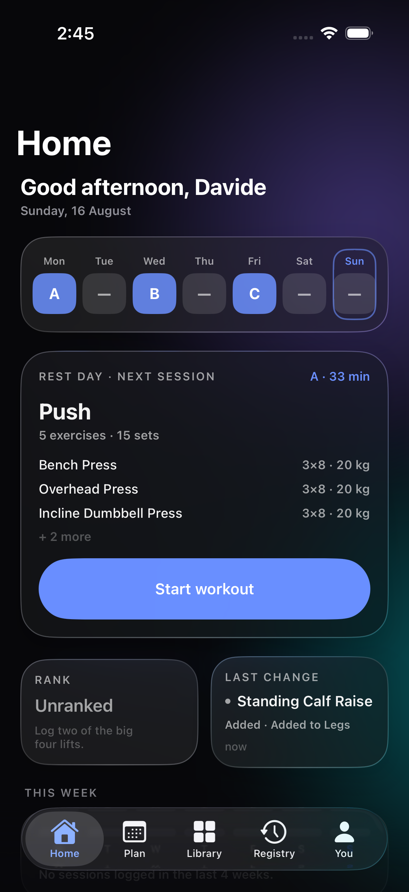
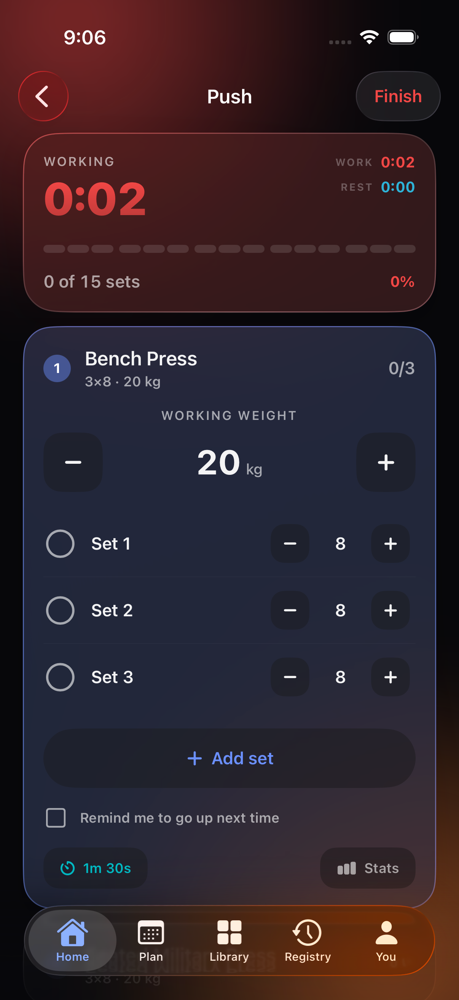
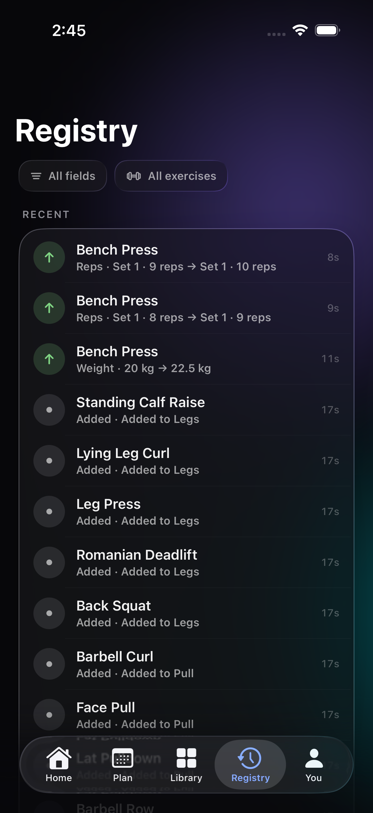
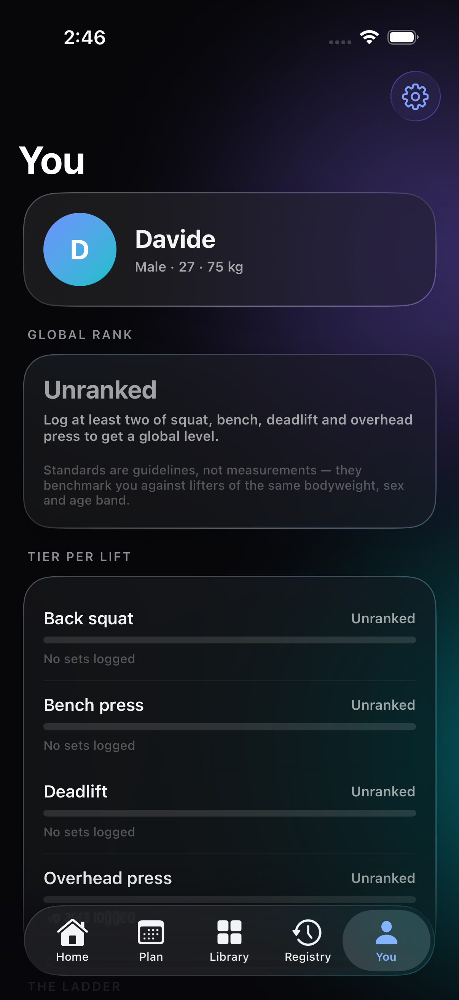
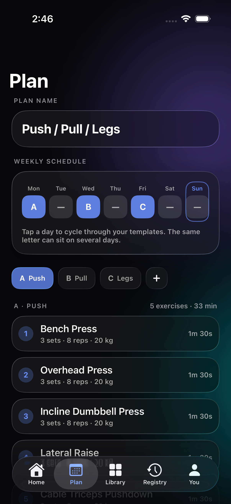
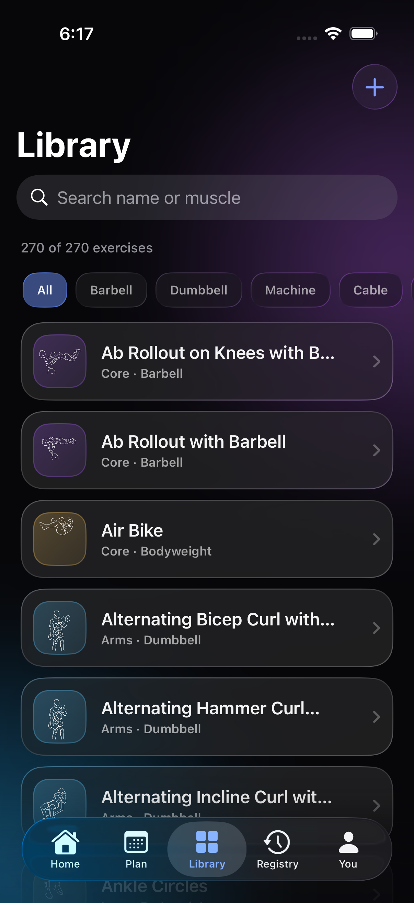
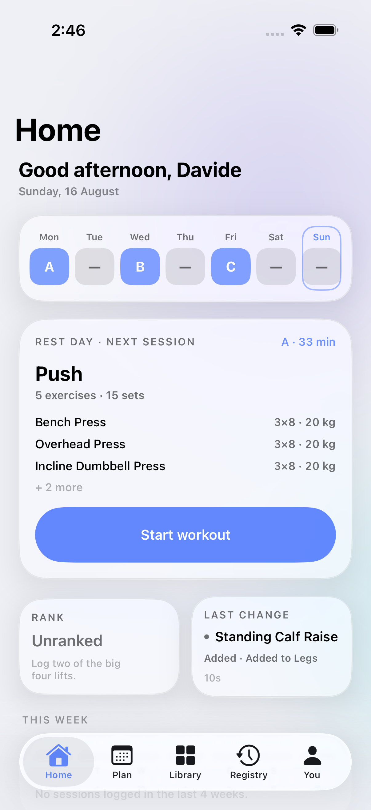

# Gym Tracker

A native iPhone app for tracking strength progression. SwiftUI + SwiftData, offline-first, no backend. The interface is English throughout and built on iOS 26's Liquid Glass — translucent cards over drifting gradient blooms, spring motion, and both appearances treated as first-class.

<p align="center">
  
  
  
  
</p>

## What it does

### 1. Tracking, with a change registry

Every exercise carries a working weight, a rest time, a set count and **an independent rep count per set** — sets are never forced to be uniform. Whenever one of those parameters moves, the app appends an entry to a **change registry** readable from its own tab: what changed, from what to what, and when.

The registry is append-only. Removing an exercise writes a `removed` record rather than deleting history, so "when did this last go up" always has an answer.

A per-exercise checkbox arms a *go up next time* reminder. The next session then opens at the higher weight with a **Suggested** badge you can accept or override. The same suggestion appears automatically when every set met its target.

### 2. Plan builder

A plan is a set of lettered day templates — A, B, C and onward — plus a weekly schedule. Tapping a weekday cycles it through `Rest → A → B → C → Rest`, and **the same letter can sit on several days**, which is how most real splits work.

Onboarding offers eight splits to start from — full body, upper/lower, push/pull/legs at three and six days, PPL+upper/lower, the Arnold split, a body-part split and a 5×5 strength template — or an empty plan.

Each template holds a numbered, reorderable exercise list. Exercises come from a bundled archive of **270 exercises**, every one of them carrying a two-phase line-art illustration — contracted and stretched — plus step-by-step cues and form warnings. Anything missing can be saved to your own archive and is then searchable, filterable and pickable like the rest; user-created exercises fall back to a generated diagram keyed to their equipment.

The illustrations are rasterised to alpha-only PNGs and tinted at runtime, so they read as part of the interface in both light and dark rather than as pasted-in pictures. Reference photographs sit one tap deeper, in a gallery on the exercise detail screen, for the 183 exercises where a match exists.

The plan also exports to a printable A4 PDF.

<p align="center">
  
  
  
</p>

### 3. Ranking

Per-exercise strength tiers plus one global profile level, on a shared 0–100 scale.

| Tier | Score | What it means |
|---|---|---|
| Beginner | 0–20 | First weeks under the bar |
| Novice | 20–40 | 3–6 months of steady work |
| Intermediate | 40–60 | 1–2 years · bodyweight bench |
| Advanced | 60–80 | Several years of focus |
| Elite | 80–100 | Top 5 % of natural lifters |

Tiers come from bodyweight-relative strength standards, scaled by a masters-style age coefficient (1.00 under 30, down to 0.72 past 60). A set is scored by its Epley estimated 1RM with reps capped at ten, placed piecewise-linearly between the five thresholds; each tier splits into divisions I, II and III. Bodyweight exercises are ranked on reps instead, with added load converting to effective reps.

The global level averages squat, bench, deadlift and overhead press, plus a consistency bonus of up to 5 points for training 16 times in four weeks. Fewer than two trained lifts reads as **Unranked** rather than inventing a number.

Accessory work carries no tier at all — it is tracked and charted, but keeping it off the ladder is what makes the ladder mean something. Every threshold lives in `Gym Traker/Resources/ranking.json` and can be tuned without touching code.

**These are guidelines, not measurements,** and the app says so on the profile screen.

### Apple Health

Bodyweight, sex and age can be pulled from Health so the tiers are measured against real numbers, and finished workouts recorded elsewhere — including on an Apple Watch — are imported into the history. Sessions logged in the app are written back as strength-training workouts.

One honest limit: Health only publishes a workout once it has been saved, which for a Watch workout means when it ends. Mirroring a session while it is still running would need a watchOS companion app, which this build does not have.

## Building

Requires **Xcode 26.6** and an iPhone or simulator running **iOS 26**.

```bash
open "Gym Traker.xcodeproj"
```

Pick an iPhone simulator and run. The exercise archive seeds itself on first launch.

To run the test suite from the command line:

```bash
xcodebuild -project "Gym Traker.xcodeproj" -scheme "Gym Traker" -destination 'platform=iOS Simulator,name=iPhone 17 Pro' test
```

## Tests

Unit tests (Swift Testing) cover the parts where being wrong is invisible:

- **RankingEngineTests** — both worked examples from the spec, tier boundaries, the Elite cap, age and sex tables, bodyweight scoring, the global level.
- **RegistryTests** — one entry per change, no entry when nothing changed, set indices in rep records, removal appending rather than deleting.
- **ProgressionTests** — the automatic rule, the armed flag, accepting and declining a suggestion.
- **UnitFormatterTests** — kg/lb round-tripping without drift.
- **PersistenceTests** — uneven sets surviving a reload, repeated templates, idempotent seeding, and every archive exercise resolving to a bundled photo.

UI tests (XCUITest) walk the acceptance checks against the running app: onboarding, logging a session with uneven sets, the registry recording it, a custom exercise reaching search, one template repeating on two weekdays, both appearances, and export.

## Layout

```
Gym Traker/
├── Models/          SwiftData entities
├── Services/        registry, progression, seeding, rest timer, Health, export, PDF
├── Ranking/         threshold tables and the scoring engine
├── DesignSystem/    theme, glass surfaces, aurora, exercise glyphs
├── Features/        one folder per screen
└── Resources/       exercises.json, ranking.json
design/              the design package this was built from
docs/                implementation plan and screenshots
```

`design/SPEC.md` is the product spec, `design/DATA-MODEL.md` the persistence rules, `design/RANKING.md` the tier maths with its sources, and `design/Gym Tracker.dc.html` an interactive prototype of all nine screens.

## Credits

- Exercise illustrations © [Everkinetic](https://github.com/everkinetic/data), licensed [CC BY-SA 4.0](https://creativecommons.org/licenses/by-sa/4.0/). The attribution also appears in the app under You › Settings › About, as the licence requires.
- Reference photographs from [free-exercise-db](https://github.com/yuhonas/free-exercise-db), released into the public domain under the Unlicense.
- Strength standards and age coefficients as documented in `design/RANKING.md`.

## Scope

Not in this version: cloud sync, a Watch app, HealthKit, social features, media attachments. Everything is stored in kilograms; the kg/lb switch is display-only, so tiers are identical in both units.
